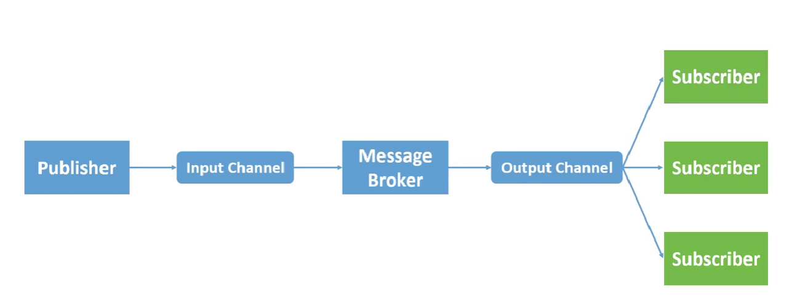
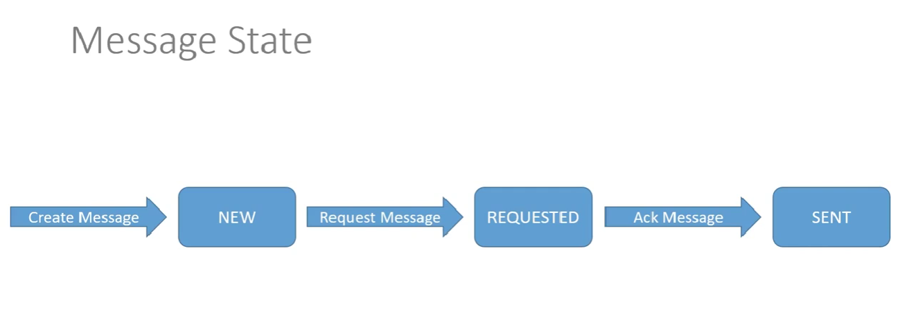
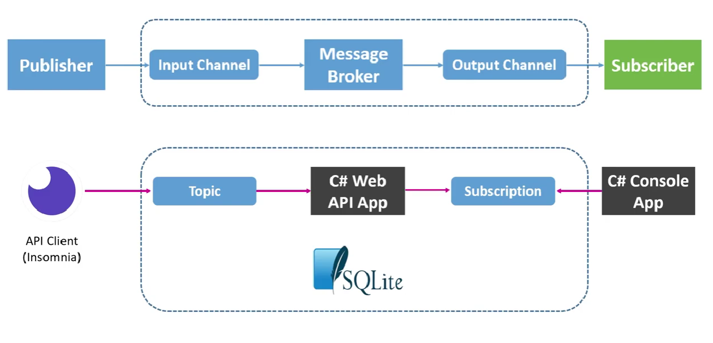
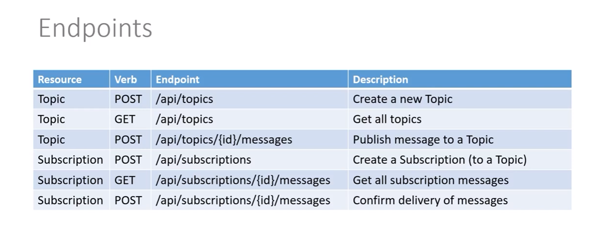

# Pub-Sub Pattern for .NET

A practical guide to the Publish-Subscribe (Pub-Sub) pattern in .NET: what it is, when to use it, and two implementations. The first is an in-process event bus. The second uses a message broker (Azure Service Bus topics and subscriptions).

## What is Pub-Sub?

In Publish-Subscribe, a **publisher** announces that something happened (an _event_) without knowing who is interested. Zero or more **subscribers** receive a copy of that event and react to it independently. An **event bus** or **message broker** sits between them.

```
                        +--> Subscriber A (Billing)
Publisher --> Topic ----+--> Subscriber B (Inventory)
                        +--> Subscriber C (Notifications)
```

Key properties:

- **Loose coupling.** Publishers do not reference subscribers. You can add a new subscriber without changing the publisher.
- **One-to-many.** Every subscription gets its own copy of each event.
- **Fire and forget.** The publisher does not wait for a result. If you need a reply, see the Request-Reply pattern instead.

## Pub-Sub vs. a work queue

|                   | Pub-Sub (topic)                    | Work queue                              |
| ----------------- | ---------------------------------- | --------------------------------------- |
| Delivery          | Each subscription gets a copy      | Each message goes to one consumer       |
| Purpose           | Notify many parties about an event | Distribute work among workers           |
| Adding a consumer | Receives its own full stream       | Shares the load with existing consumers |

Inside one subscription, you can still run several competing instances to scale processing.

## When to use it

- One business event must trigger several independent reactions (for example, `OrderCreated` triggers billing, stock reservation, and an email).
- Services should be deployable and scalable independently.
- You want to add new reactions later without touching existing code.

## When it may not fit

- The caller needs an immediate result. Use a direct call or Request-Reply.
- You need strict, global ordering across all events. Pub-Sub usually guarantees ordering only within a partition, session, or key.
- A small monolith with one consumer. A plain method call is simpler.

## In this source we have:

### Pub-Sub Pattern:









## Option 1: In-process event bus

Use this inside a single application (for example, a modular monolith). Events are lost if the process stops, so do not use it for work that must survive a crash.

Requires .NET 8 or later (C# 12 primary constructors) and `Microsoft.Extensions.DependencyInjection`.

```csharp
public interface IEvent { }

public interface IEventHandler<in TEvent> where TEvent : IEvent
{
    Task HandleAsync(TEvent @event, CancellationToken ct);
}

public interface IEventBus
{
    Task PublishAsync<TEvent>(TEvent @event, CancellationToken ct = default)
        where TEvent : IEvent;
}

public sealed class InMemoryEventBus(IServiceProvider services) : IEventBus
{
    public async Task PublishAsync<TEvent>(TEvent @event, CancellationToken ct = default)
        where TEvent : IEvent
    {
        foreach (var handler in services.GetServices<IEventHandler<TEvent>>())
        {
            await handler.HandleAsync(@event, ct);
        }
    }
}
```

Define an event and two subscribers:

```csharp
public sealed record OrderCreated(Guid OrderId, decimal Total) : IEvent;

public sealed class SendConfirmationEmail(ILogger<SendConfirmationEmail> logger)
    : IEventHandler<OrderCreated>
{
    public Task HandleAsync(OrderCreated e, CancellationToken ct)
    {
        logger.LogInformation("Sending email for order {OrderId}", e.OrderId);
        return Task.CompletedTask;
    }
}

public sealed class ReserveStock(ILogger<ReserveStock> logger)
    : IEventHandler<OrderCreated>
{
    public Task HandleAsync(OrderCreated e, CancellationToken ct)
    {
        logger.LogInformation("Reserving stock for order {OrderId}", e.OrderId);
        return Task.CompletedTask;
    }
}
```

Register and publish:

```csharp
builder.Services.AddScoped<IEventBus, InMemoryEventBus>();
builder.Services.AddTransient<IEventHandler<OrderCreated>, SendConfirmationEmail>();
builder.Services.AddTransient<IEventHandler<OrderCreated>, ReserveStock>();

app.MapPost("/orders", async (IEventBus bus, CancellationToken ct) =>
{
    var orderId = Guid.NewGuid();
    await bus.PublishAsync(new OrderCreated(orderId, 99.90m), ct);
    return Results.Accepted($"/orders/{orderId}");
});
```

Notes:

- Handlers run sequentially in this sketch. A slow or failing handler delays or breaks the publish call. Decide whether to isolate failures (try/catch per handler), run handlers in parallel, or move to a broker.
- For a ready-made in-process option, MediatR notifications follow the same idea.

## Option 2: Message broker with Azure Service Bus

Use a broker when subscribers live in different processes or services, or when events must survive restarts. In Azure Service Bus, the publisher sends to a **topic**, and each consumer reads from its own **subscription** on that topic.

Packages:

```bash
dotnet add package Azure.Messaging.ServiceBus
dotnet add package Azure.Identity
```

### Publisher

```csharp
using Azure.Identity;
using Azure.Messaging.ServiceBus;

await using var client = new ServiceBusClient(
    "<your-namespace>.servicebus.windows.net",
    new DefaultAzureCredential());

ServiceBusSender sender = client.CreateSender("orders"); // topic name

var evt = new OrderCreated(Guid.NewGuid(), 99.90m);

var message = new ServiceBusMessage(BinaryData.FromObjectAsJson(evt))
{
    MessageId = evt.OrderId.ToString(), // enables duplicate detection if turned on
    Subject = nameof(OrderCreated),
    ContentType = "application/json"
};

await sender.SendMessageAsync(message);
```

### Subscriber

Create a subscription per consumer (for example `billing`, `inventory`) in the Azure portal, CLI, or infrastructure code.

```csharp
ServiceBusProcessor processor = client.CreateProcessor(
    topicName: "orders",
    subscriptionName: "billing",
    new ServiceBusProcessorOptions
    {
        MaxConcurrentCalls = 4,
        AutoCompleteMessages = false
    });

processor.ProcessMessageAsync += async args =>
{
    var evt = args.Message.Body.ToObjectFromJson<OrderCreated>();

    // Handle the event. This must be safe to run more than once.
    await BillingService.CreateInvoiceAsync(evt, args.CancellationToken);

    await args.CompleteMessageAsync(args.Message); // remove from the subscription
};

processor.ProcessErrorAsync += args =>
{
    Console.Error.WriteLine($"Service Bus error: {args.Exception}");
    return Task.CompletedTask;
};

await processor.StartProcessingAsync();
```

If the handler throws, the message is abandoned and delivered again. After the maximum delivery count is reached, the broker moves it to the **dead-letter queue** of that subscription.

For hosted services, register the processor in a `BackgroundService` so it starts and stops with your application.

## Design considerations

- **At-least-once delivery.** Most brokers can deliver a message more than once. Make handlers **idempotent**, for example by storing processed message IDs or by using natural upserts.
- **Ordering.** Do not assume global order. If order matters per entity, use sessions or partition keys (for example, keyed by `OrderId`).
- **Dead-letter handling.** Monitor the dead-letter queue and have a process to inspect, fix, and replay messages.
- **Reliable publishing.** Saving data and publishing an event are two separate operations, and one can fail. Use the **Transactional Outbox** pattern: write the event to an outbox table in the same database transaction, then publish from there.
- **Event design.** Keep events small, immutable, and named in the past tense (`OrderCreated`). Include an event ID, a timestamp, and a version.
- **Schema evolution.** Add fields in a backward-compatible way. Subscribers deploy at different times, so tolerate unknown fields and version breaking changes.
- **Backpressure.** Limit concurrency (`MaxConcurrentCalls`) so a burst of events does not overwhelm a downstream database or API.
- **Observability.** Propagate a correlation or trace ID in message properties and log it in every handler. Track subscription backlog and dead-letter counts.
- **Security.** Prefer managed identity (`DefaultAzureCredential`) over connection strings, and grant publishers send-only and subscribers receive-only permissions.

## Libraries that can help

- **MassTransit** and **NServiceBus**: higher-level messaging frameworks with retries, sagas, and outbox support.
- **Wolverine**: messaging and mediator framework with built-in outbox.
- **Dapr Pub/Sub**: broker-agnostic building block with a simple HTTP/SDK API.
- **MediatR**: in-process notifications.

## References

- [Publisher-Subscriber pattern, Azure Architecture Center](https://learn.microsoft.com/en-us/azure/architecture/patterns/publisher-subscriber)
- [Azure Service Bus topics and subscriptions](https://learn.microsoft.com/en-us/azure/service-bus-messaging/service-bus-queues-topics-subscriptions)
- [Azure.Messaging.ServiceBus client library for .NET](https://learn.microsoft.com/en-us/dotnet/api/overview/azure/messaging.servicebus-readme)

- Les Jackson
